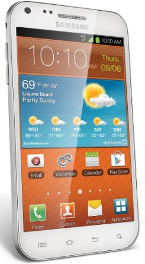
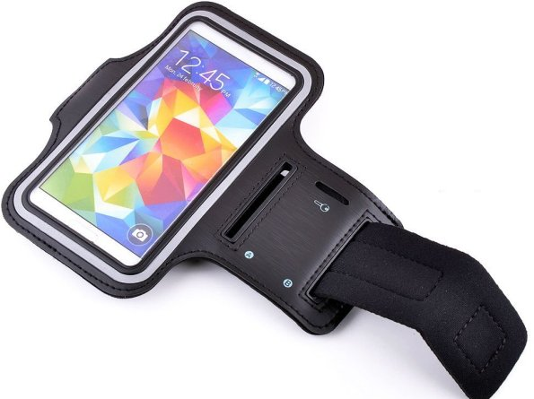

# Code Book

## Data Set Information

### UC Irvine Machine Learning Repository  
Center for Machine Learning and Intelligent Systems

* * *

<figure style="float:right">
<figcaption>Samsung Galaxy S II  
Smartphone</figcaption>

</figure>

The experiments have been carried out with a group of 30 volunteers within an age bracket of 19 – 48 years. Each person performed six activities (WALKING, WALKING_UPSTAIRS, WALKING_DOWNSTAIRS, SITTING, STANDING, LAYING) wearing a smartphone (Samsung® Galaxy S II) on the waist. Using its embedded accelerometer and gyroscope, we captured 3-axial linear acceleration and 3-axial angular velocity at a constant rate of 50Hz. The experiments have been video-recorded to label the data manually. The obtained dataset has been randomly partitioned into two sets, where 70% of the volunteers was selected for generating the training data and 30% the test data.
<figure style="float:left">
<figcaption>Smartphone Harness  
Arm or Body Bands</figcaption>

</figure>

The sensor signals (accelerometer and gyroscope) were pre-processed by applying noise filters and then sampled in fixed-width sliding windows of 2.56 sec and 50% overlap (128 readings/window). The sensor acceleration signal, which has gravitational and body motion components, was separated using a Butterworth low-pass filter into body acceleration and gravity. The gravitational force is assumed to have only low frequency components, therefore a filter with 0.3 Hz cutoff frequency was used. From each window, a vector of features was obtained by calculating variables from the time and frequency domain.
A sample video of the experiment including an example of the 6 recorded activities with one of the participants is available on YouTube® as: [Activity Recognition Experiment Using Smartphone Sensors](https://www.youtube.com/watch?v=XOEN9W05_4A).

## Data Set Description

*   Triaxial acceleration from the accelerometer (total acceleration) and the estimated body acceleration.
*   Triaxial Angular velocity from the gyroscope.
*   A 561-feature vector with time and frequency domain variables.
*   Its activity label.
*   An identifier of the subject who carried out the experiment.

*   `README.txt`
*   `features_info.txt`: Shows information about the variables used on the feature vector.
*   `features.txt`: List of all features.
*   `activity_labels.txt`: Links the class labels with their activity name.
*   `train/X_train.txt`: Training set.
*   `train/y_train.txt`: Training labels.
*   `test/X_test.txt`: Test set.
*   `test/y_test.txt`: Test labels.

*   `train/subject_train.txt`: Each row identifies the subject who performed the activity for each window sample. Its range is from 1 to 30.
*   `train/Inertial Signals/total_acc_x_train.txt`: The acceleration signal from the smartphone accelerometer X axis in standard gravity units 'g'. Every row shows a 128 element vector. The same description applies for the `total_acc_x_train.txt` and `total_acc_z_train.txt` files for the Y and Z axis.
*   `train/Inertial Signals/body_acc_x_train.txt`: The body acceleration signal obtained by subtracting the gravity from the total acceleration.
*   `train/Inertial Signals/body_gyro_x_train.txt`: The angular velocity vector measured by the gyroscope for each window sample. The units are radians/second.

*   Features are normalized and bounded within [-1,1].
*   Each feature vector is a row on the text file.
*   The units used for the accelerations (total and body) are 'g's (gravity of earth → 9.80665 m/seg2).
*   The gyroscope units are rad/seg.

For more information about this dataset please contact: `activityrecognition'@'smartlab.ws`

## Data Transformation
